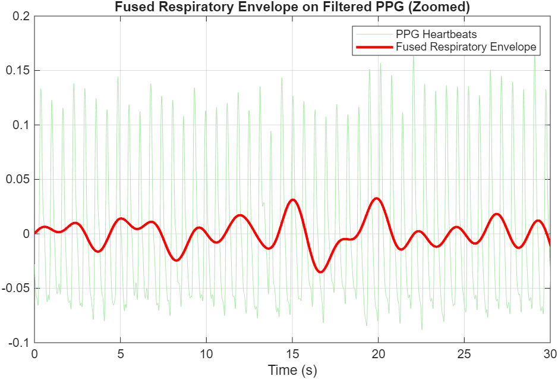
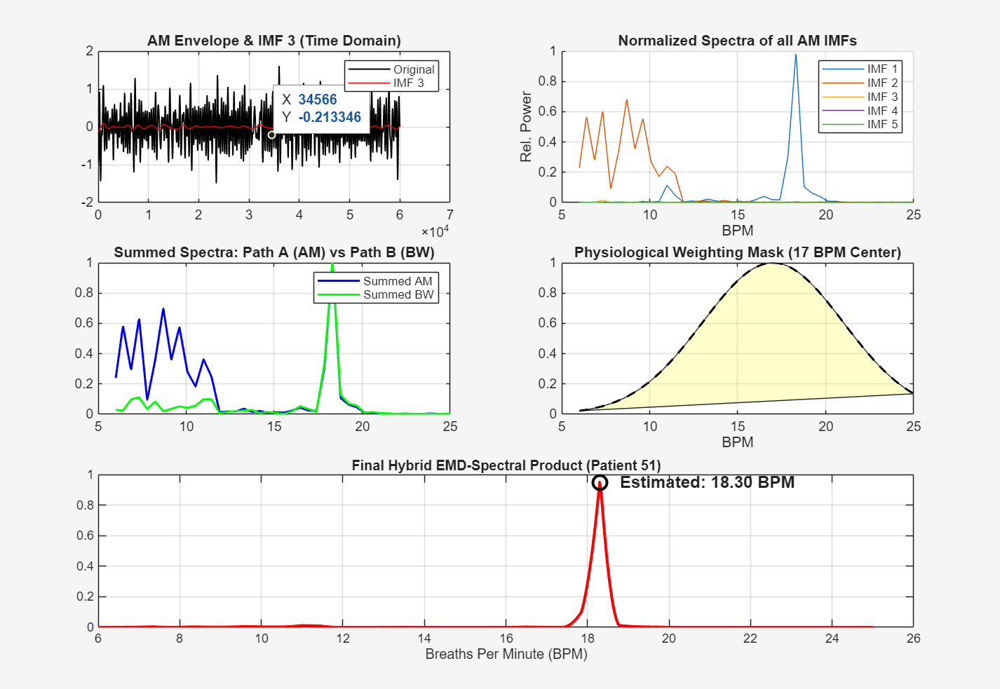
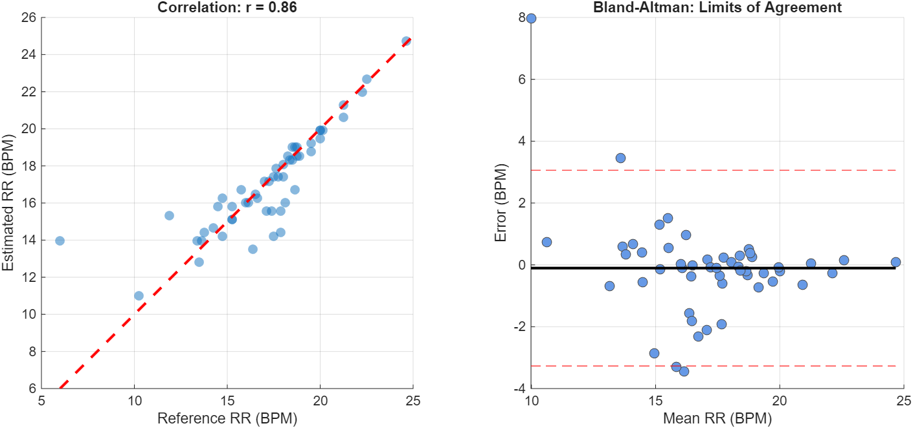

# Respiratory Rate Estimation from PPG Signals

## 📌 Overview
This project estimates respiratory rate (RR) from Photoplethysmography (PPG) signals using a hybrid signal processing approach combining amplitude modulation (AM) and baseline wander (BW) components.

## ⚙️ Methodology
- Bandpass filtering of PPG signal (0.5–8 Hz)
- Hilbert transform for amplitude modulation extraction
- Baseline wander extraction using low-pass filtering
- Fusion of AM and BW signals
- Empirical Mode Decomposition (EMD)
- Spectral analysis using periodogram
- Hybrid spectral product with Gaussian weighting

## 📊 Results
- Mean Absolute Error (MAE): 0.88 BPM
- Accuracy (<1 BPM): 77.4%
- Strong correlation with reference respiration

## 🛠 Tools Used
- MATLAB
- Signal Processing Toolbox

## 📷 Sample Outputs

### 🔹 Fused Respiratory Envelope

### 🔹 Hybrid Spectral Analysis

### 🔹 Bland-Altman Plot

## 📂 Project Structure
